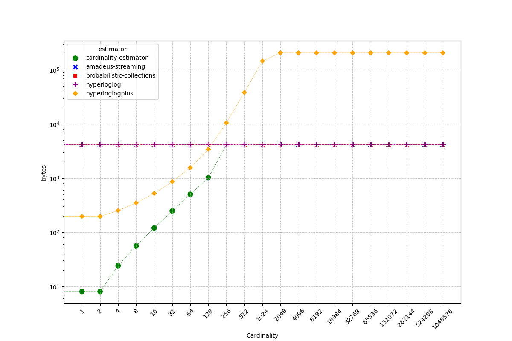
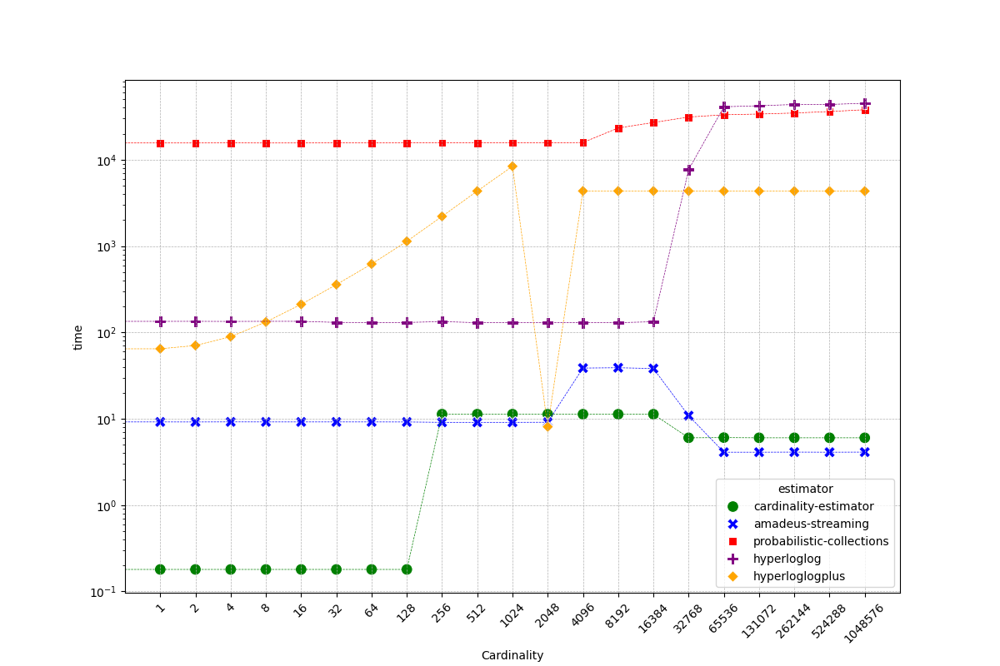
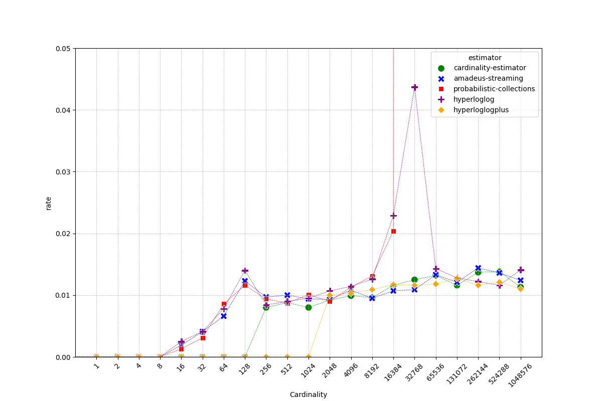

# cardinality-estimator

[](https://docs.rs/cardinality-estimator)
[](https://crates.io/crates/cardinality-estimator)
[](LICENSE)

`cardinality-estimator` is a Rust crate designed to estimate the number of distinct elements in a stream or dataset in an efficient manner.
This library uses HyperLogLog++ with an optimized low memory footprint and high accuracy approach, suitable for large-scale data analysis tasks.
We're using `cardinality-estimator` for large-scale machine learning, computing cardinality features across multiple dimensions of the request.

## Overview
Our `cardinality-estimator` is highly efficient in terms of memory usage, latency, and accuracy.
This is achieved by leveraging a combination of unique data structure design, efficient algorithms, and HyperLogLog++ for high cardinality ranges.

## Getting Started
To use `cardinality-estimator`, add it to your `Cargo.toml` under `[dependencies]`:
```toml
[dependencies]
cardinality-estimator = "1.0.0"
```
Then, import `cardinality-estimator` in your Rust program:
```rust
use cardinality_estimator::CardinalityEstimator;

let mut estimator = CardinalityEstimator::<12, 6>::new();
estimator.insert("test");
let estimate = estimator.estimate();

println!("estimate = {}", estimate);
```

Please refer to our [examples](examples) and [benchmarks](benches) in the repository for more complex scenarios.

## Low memory footprint
The `cardinality-estimator` achieves low memory footprint by leveraging an efficient data storage format.
The data is stored in three different representations - `Small`, `Array`, and `HyperLogLog` - depending on the cardinality range.
For instance, for a cardinality of 0 to 2, only **8 bytes** of stack memory and 0 bytes of heap memory are used.

## Low latency
The crate offers low latency by using auto-vectorization for slice operations via compiler hints to use SIMD instructions.
The number of zero registers and registers' harmonic sum are stored and updated dynamically as more data is inserted, resulting in fast estimate operations.

## High accuracy
The cardinality-estimator achieves high accuracy by using precise counting for small cardinality ranges and HyperLogLog++ with LogLog-Beta bias correction for larger ranges.
This provides expected error rates as low as 0.02% for large cardinalities.

## Benchmarks

To run benchmarks you first need to install `cargo-criterion` binary:
```shell
cargo install cargo-criterion
```

Then benchmarks with output format JSON to save results for further analysis:
```shell
make bench
```

We've benchmarked cardinality-estimator against several other crates in the ecosystem:
* [hyperloglog](https://crates.io/crates/hyperloglog)
* [hyperloglogplus](https://crates.io/crates/hyperloglogplus)
* [amadeus-streaming](https://crates.io/crates/amadeus-streaming)
* [probabilistic-collections](https://crates.io/crates/probabilistic-collections)

Please note, that [hyperloglog](https://github.com/jedisct1/rust-hyperloglog/blob/1.0.2/src/lib.rs#L33) and [probabilistic-collections](https://gitlab.com/jeffrey-xiao/probabilistic-collections-rs/-/blob/da2a331e9679e4686bdcc772c369b639b9c33dee/src/hyperloglog.rs#L103) crates have bug in calculation of precision `p` based on provided `probability`:
* incorrect formula: `p = (1.04 / error_probability).powi(2).ln().ceil() as usize;`
* corrected formula: `p = (1.04 / error_probability).powi(2).log2().ceil() as usize;`

We're continuously working to make `cardinality-estimator` the fastest, lightest, and most accurate tool for cardinality estimation in Rust.

Benchmarks presented below are executed on Linux laptop with `13th Gen Intel(R) Core(TM) i7-13800H` processor and compiler flags set to `RUSTFLAGS=-C target-cpu=native`.

### Memory usage


Table below compares memory usage of different cardinality estimators.
The number in each cell represents `stack memory bytes / heap memory bytes / heap memory blocks` at each measured cardinality.

Our `cardinality-estimator` achieves the lowest stack and heap memory allocations across all different cardinalities.

Note, that `hyperloglogplus` implementation has particularly high memory usage especially for cardinalities above 256.

| cardinality | cardinality_estimator | amadeus_streaming | probabilistic_collections | hyperloglog    | hyperloglogplus    |
|-------------|-----------------------|-------------------|---------------------------|----------------|--------------------|
| 0           | **8 / 0 / 0**         | 48 / 4096 / 1     | 128 / 4096 / 1            | 120 / 4464 / 2 | 160 / 0 / 0        |
| 1           | **8 / 0 / 0**         | 48 / 4096 / 1     | 128 / 4096 / 1            | 120 / 4096 / 1 | 160 / 36 / 1       |
| 2           | **8 / 0 / 0**         | 48 / 4096 / 1     | 128 / 4096 / 1            | 120 / 4096 / 1 | 160 / 36 / 1       |
| 4           | **8 / 16 / 1**        | 48 / 4096 / 1     | 128 / 4096 / 1            | 120 / 4096 / 1 | 160 / 92 / 2       |
| 8           | **8 / 48 / 2**        | 48 / 4096 / 1     | 128 / 4096 / 1            | 120 / 4096 / 1 | 160 / 188 / 3      |
| 16          | **8 / 112 / 3**       | 48 / 4096 / 1     | 128 / 4096 / 1            | 120 / 4096 / 1 | 160 / 364 / 4      |
| 32          | **8 / 240 / 4**       | 48 / 4096 / 1     | 128 / 4096 / 1            | 120 / 4096 / 1 | 160 / 700 / 5      |
| 64          | **8 / 496 / 5**       | 48 / 4096 / 1     | 128 / 4096 / 1            | 120 / 4096 / 1 | 160 / 1400 / 13    |
| 128         | **8 / 1008 / 6**      | 48 / 4096 / 1     | 128 / 4096 / 1            | 120 / 4096 / 1 | 160 / 3261 / 23    |
| 256         | **8 / 4092 / 7**      | 48 / 4096 / 1     | 128 / 4096 / 1            | 120 / 4096 / 1 | 160 / 10361 / 43   |
| 512         | **8 / 4092 / 7**      | 48 / 4096 / 1     | 128 / 4096 / 1            | 120 / 4096 / 1 | 160 / 38295 / 83   |
| 1024        | **8 / 4092 / 7**      | 48 / 4096 / 1     | 128 / 4096 / 1            | 120 / 4096 / 1 | 160 / 146816 / 163 |
| 2048        | **8 / 4092 / 7**      | 48 / 4096 / 1     | 128 / 4096 / 1            | 120 / 4096 / 1 | 160 / 207711 / 194 |
| 4096        | **8 / 4092 / 7**      | 48 / 4096 / 1     | 128 / 4096 / 1            | 120 / 4096 / 1 | 160 / 207711 / 194 |
| 8192        | **8 / 4092 / 7**      | 48 / 4096 / 1     | 128 / 4096 / 1            | 120 / 4096 / 1 | 160 / 207711 / 194 |
| 16384       | **8 / 4092 / 7**      | 48 / 4096 / 1     | 128 / 4096 / 1            | 120 / 4096 / 1 | 160 / 207711 / 194 |
| 32768       | **8 / 4092 / 7**      | 48 / 4096 / 1     | 128 / 4096 / 1            | 120 / 4096 / 1 | 160 / 207711 / 194 |
| 65536       | **8 / 4092 / 7**      | 48 / 4096 / 1     | 128 / 4096 / 1            | 120 / 4096 / 1 | 160 / 207711 / 194 |
| 131072      | **8 / 4092 / 7**      | 48 / 4096 / 1     | 128 / 4096 / 1            | 120 / 4096 / 1 | 160 / 207711 / 194 |
| 262144      | **8 / 4092 / 7**      | 48 / 4096 / 1     | 128 / 4096 / 1            | 120 / 4096 / 1 | 160 / 207711 / 194 |
| 524288      | **8 / 4092 / 7**      | 48 / 4096 / 1     | 128 / 4096 / 1            | 120 / 4096 / 1 | 160 / 207711 / 194 |
| 1048576     | **8 / 4092 / 7**      | 48 / 4096 / 1     | 128 / 4096 / 1            | 120 / 4096 / 1 | 160 / 207711 / 194 |

### Insert performance


Table below represents insert time in nanoseconds per element.

Our `cardinality-estimator` demonstrates the lowest insert time for most of the cardinalities.

|   cardinality | cardinality-estimator   | amadeus-streaming   |   probabilistic-collections |   hyperloglog | hyperloglogplus   |
|---------------|-------------------------|---------------------|-----------------------------|---------------|-------------------|
|             0 | **0.64**                | 88.12               |                       70.19 |         82.69 | 17.45             |
|             1 | **2.42**                | 91.5                |                       80.2  |        131.86 | 60.65             |
|             2 | **2.21**                | 44.3                |                       45.34 |         81.48 | 34.96             |
|             4 | **6.9**                 | 25.59               |                       24.85 |         54.38 | 36.22             |
|             8 | **7.27**                | 15.62               |                       17.92 |         43.54 | 35.55             |
|            16 | **6.99**                | 12.15               |                       14.44 |         37.24 | 33.4              |
|            32 | **7.9**                 | 9.6                 |                       12.78 |         34.23 | 32.49             |
|            64 | 10.14                   | **8.97**            |                       11.86 |         32.55 | 39.04             |
|           128 | 15.47                   | **8.52**            |                       11.49 |         31.76 | 48.37             |
|           256 | 13.42                   | **8.01**            |                       11.24 |         31.44 | 65.58             |
|           512 | 9.92                    | **8.1**             |                       11.11 |         31.34 | 100.25            |
|          1024 | 8.32                    | **8.14**            |                       12.52 |         31.73 | 171.71            |
|          2048 | **7.31**                | 7.92                |                       12.52 |         32.03 | 120.71            |
|          4096 | **7.11**                | 8.01                |                       11.04 |         32.73 | 63.5              |
|          8192 | 8.81                    | **8.02**            |                       10.97 |         33.08 | 37.36             |
|         16384 | 8.08                    | **8.01**            |                       11.03 |         32.75 | 22.24             |
|         32768 | **6.55**                | 7.96                |                       11.01 |         32.37 | 13.3              |
|         65536 | **5.35**                | 7.96                |                       10.96 |         31.95 | 8.41              |
|        131072 | **4.48**                | 7.9                 |                       10.97 |         31.71 | 5.71              |
|        262144 | **3.91**                | 7.95                |                       10.95 |         31.52 | 4.26              |
|        524288 | 3.58                    | 7.64                |                       10.95 |         31.47 | **3.47**          |
|       1048576 | 3.35                    | 7.95                |                       10.95 |         31.47 | **3.04**          |

### Estimate performance


Table below represents estimate time in nanoseconds per call.

Our `cardinality-estimator` shows the lowest estimate time for most of the cardinalities, especially smaller cardinalities up to 128.

Note, that `amadeus-streaming` implementation is also quite effective at estimate operation, however it has higher memory usage as indicated by table above.
Implementations `probabilistic-collections`, `hyperloglogplus` and `hyperloglogplus` have much higher estimate time, especially for higher cardinalities.

|   cardinality | cardinality-estimator   | amadeus-streaming   |   probabilistic-collections |   hyperloglog | hyperloglogplus   |
|---------------|-------------------------|---------------------|-----------------------------|---------------|-------------------|
|             0 | **0.18**                | 7.9                 |                     15576.4 |        125.03 | 24.89             |
|             1 | **0.18**                | 9.19                |                     15619.8 |        134.3  | 64.62             |
|             2 | **0.18**                | 9.18                |                     15615.5 |        134.4  | 70.51             |
|             4 | **0.18**                | 9.2                 |                     15642.7 |        134.01 | 89.16             |
|             8 | **0.18**                | 9.19                |                     15611.1 |        134.41 | 132.0             |
|            16 | **0.18**                | 9.19                |                     15621.6 |        134.39 | 211.4             |
|            32 | **0.18**                | 9.19                |                     15637.1 |        130.58 | 357.55            |
|            64 | **0.18**                | 9.19                |                     15626   |        130.26 | 619.95            |
|           128 | **0.18**                | 9.18                |                     15640.8 |        130.33 | 1134.12           |
|           256 | 11.31                   | **9.09**            |                     15668   |        133.5  | 2205.7            |
|           512 | 11.3                    | **9.09**            |                     15652   |        129.58 | 4334.05           |
|          1024 | 11.31                   | **9.09**            |                     15687.1 |        129.79 | 8392.59           |
|          2048 | 11.28                   | 9.11                |                     15680.4 |        129.8  | **8.08**          |
|          4096 | **11.29**               | 38.63               |                     15803.4 |        129.49 | 4342.07           |
|          8192 | **11.28**               | 38.98               |                     23285   |        129.51 | 4345.7            |
|         16384 | **11.29**               | 38.17               |                     26950.7 |        132.96 | 4341.9            |
|         32768 | **6.02**                | 10.86               |                     31168   |       7674.3  | 4334.98           |
|         65536 | 6.05                    | **4.1**             |                     33123.8 |      40986.4  | 4327.48           |
|        131072 | 6.02                    | **4.1**             |                     33772.4 |      42113.7  | 4327.29           |
|        262144 | 6.02                    | **4.11**            |                     34711.7 |      43587    | 4329.63           |
|        524288 | 6.02                    | **4.1**             |                     36091.2 |      43582.8  | 4327.8            |
|       1048576 | 6.02                    | **4.11**            |                     37877.1 |      45055.3  | 4327.37           |

### Error rate


Table below represents average absolute relative error across 100 runs of estimator on random elements at given cardinality.

Our `cardinality-estimator` performs on par well with `amadeus-streaming` and `hyperloglog` estimators, but has especially smaller low error rate for cardinalities up to 128.

Note, that `probabilistic-collections` implementation seems to have bug in its estimation operation for cardinalities >=32768.

| cardinality | cardinality_estimator | amadeus_streaming | probabilistic_collections | hyperloglog | hyperloglogplus |
|-------------|-----------------------|-------------------|---------------------------|-------------|-----------------|
| 0           | **0.0000**            | **0.0000**        | **0.0000**                | **0.0000**  | **0.0000**      |
| 1           | **0.0000**            | **0.0000**        | **0.0000**                | **0.0000**  | **0.0000**      |
| 2           | **0.0000**            | **0.0000**        | **0.0000**                | **0.0000**  | **0.0000**      |
| 4           | **0.0000**            | **0.0000**        | **0.0000**                | **0.0000**  | **0.0000**      |
| 8           | **0.0000**            | **0.0000**        | **0.0000**                | **0.0000**  | **0.0000**      |
| 16          | **0.0000**            | 0.0019            | 0.0013                    | 0.0025      | **0.0000**      |
| 32          | **0.0000**            | 0.0041            | 0.0031                    | 0.0041      | **0.0000**      |
| 64          | **0.0000**            | 0.0066            | 0.0086                    | 0.0078      | **0.0000**      |
| 128         | **0.0000**            | 0.0123            | 0.0116                    | 0.0140      | **0.0000**      |
| 256         | 0.0080                | 0.0097            | 0.0094                    | 0.0084      | **0.0000**      |
| 512         | 0.0088                | 0.0100            | 0.0087                    | 0.0090      | **0.0000**      |
| 1024        | 0.0080                | 0.0094            | 0.0101                    | 0.0095      | **0.0000**      |
| 2048        | 0.0092                | 0.0093            | **0.0090**                | 0.0107      | 0.0100          |
| 4096        | **0.0099**            | 0.0108            | 0.0113                    | 0.0114      | 0.0103          |
| 8192        | 0.0096                | **0.0095**        | 0.0131                    | 0.0126      | 0.0109          |
| 16384       | 0.0116                | **0.0107**        | 0.0204                    | 0.0229      | 0.0117          |
| 32768       | 0.0125                | **0.0109**        | 1.46e14                   | 0.0437      | 0.0116          |
| 65536       | 0.0132                | 0.0133            | 2.81e14                   | 0.0143      | **0.0118**      |
| 131072      | **0.0116**            | 0.0121            | 1.41e14                   | 0.0128      | 0.0127          |
| 262144      | 0.0137                | 0.0144            | 7.04e13                   | 0.0122      | **0.0116**      |
| 524288      | 0.0138                | 0.0136            | 3.52e13                   | **0.0116**  | 0.0121          |
| 1048576     | 0.0113                | 0.0124            | 1.76e13                   | 0.0141      | **0.0110**      |
| **mean**    | 0.0064                | 0.0078            | 3.14e13                   | 0.0101      | **0.0052**      |
